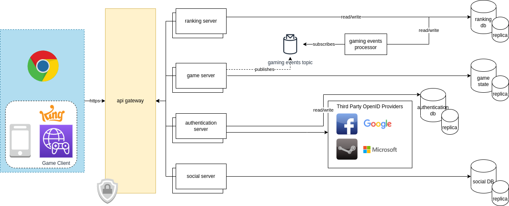

# Architecture/design exercise

## Requirements

The back end application for a specific game has the following requirements:

1. Save and retrieve user progress
2. Retrieve 10 top scores
3. Add and remove friends in game with the option of seeing the highest score,
4. It should manage a lot of concurrent connections and spikes during game events.

Define the architecture of the application like you would implement it in the real world.
There are no restrictions in framework and/or technology apart from developing it in Python or Java.

## Proposal

### Assumptions

- Realtime multiplayer game
- Can be run on browser and mobile (client needed)
- Communication is done via https/TCP

### Api Gateway

Application Programming Interface that sits between the customers and the backend of the applications (We can think of it as a Reverse Proxy).

### Ranking Server

Service resposible for handling retrieving the top 10 scores.

### Game Server

Service resposible for providing the game content.

### Authentication Server

Service resposible for handling the authentication/login of our players.

#### Third Party OpenID Proviers

External OpenID providers that facilitates the registration and login process for our users.

### Social Server

Service responsible for social actions, like adding and removing friends, messages between our players.

### Databases

All the databases have their replicas for both, disaster recovery and extensibility, like integrating analytics for example.
